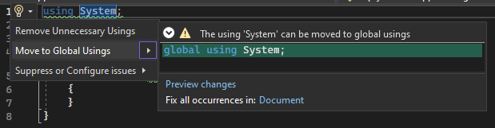
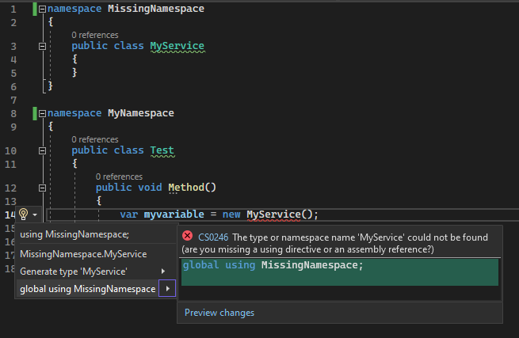

# GlobalUsingsAnalyzer
This is a analyzer and code fix provider for C# that moves usings from the file they are used to a file called Usings.cs.

## Usage
1. Install the nuget package https://www.nuget.org/packages/MoveToGlobalUsingsAnalyzer
2. The code fix will appear as a lightbulb with action 'Move to Global Usings' next to using statement, or you can use the **Fix all** button to fix all occurrences in the document at once.

## Configuration
### .editorconfig
- dotnet_diagnostic.global_usings.severity = suggestion
- dotnet_diagnostic.global_usings.file_name = Usings.cs
- dotnet_diagnostic.global_usings.sort = **true** | false

## Versions - features

### v1.0.0
Move to Global Usings


### v1.1.0
Support for .editorconfig - severity and file name

### v1.2.0
CodeFix CS0246


### v1.3.0
Global usings are automatically sorted
- .editorconfig **dotnet_diagnostic.global_usings.sort** = true | false
- Support for **dotnet_sort_system_directives_first**

### v1.4.0
Sort - global usings with alias are always last. The alias is not considered when sorting.

Example:
```
global using ZNamespace;
global using MyService = ANamespace.MyService;
```

## Implementation

### CodeFixProvider
The **GlobalUsingsAnalyzerCodeFixProvider** class is responsible for providing the code fix. It contains the following methods:

- **FixableDiagnosticIds**: Returns the diagnostic IDs that this provider can fix.
- **GetFixAllProvider**: Returns a FixAllProvider that can handle the Fix all button.
- **RegisterCodeFixesAsync**: Registers the code fix action for each diagnostic.

The code fix is implemented in the **ReplaceUsingWithGlobalAsync** method, which takes the document, the using directive syntax node, and a cancellation token as parameters. It first removes the using directive from the original file and adds it to the Usings.cs file, creating the file if it does not exist. It then returns the updated solution.

### GlobalUsingsFixAllProvider
The **GlobalUsingsFixAllProvider** is the class that handle the Fix All button.

### CodeFixResources
The **CodeFixResources** is a class that contains the title of the code fix action.
